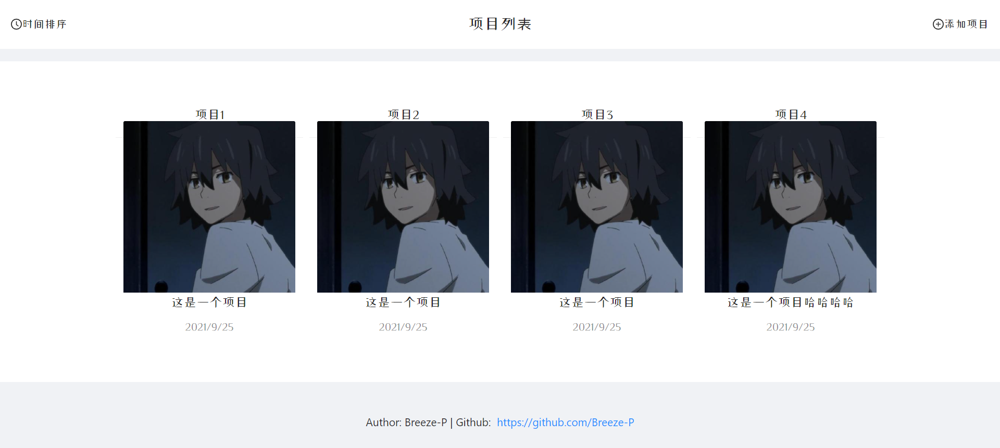
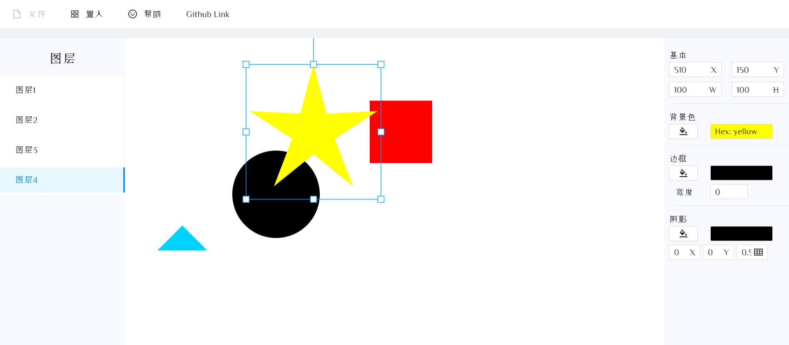

# bytedance-camp-project


## 项目部署

* git clone https://github.com/Breeze-P/bytedance-camp-project.git
* 进入server文件夹
  * npm install
  * npm run serve
* 进入web文件夹
  * npm install
  * npm run start

## PRD

### 项目info

名称：原型设计主页_demo

作者：Breeze_P 赵治宇 北京交通大学

手机：15615411381

Github：<a href="https://github.com/Breeze-P">Breeze_P</a>


### 核心需求

* 实现项目列表的增删该查，点击实现界面跳转至其所在项目详情页
* 每个项目附加一个详情页，用于实现核心功能：原型设计
* 原型设计：
  * 可增删改查图层属性
  * 顶部Tab可置入新图层
  * 左侧边栏可查询已经上架的图层
  * 右侧边栏同步显示且可修改图层的坐标、大小、颜色与阴影、边框等属性
  * 可输出图层代码


### 项目初步

```
// 项目列表页
```



```
// 详情页
```


